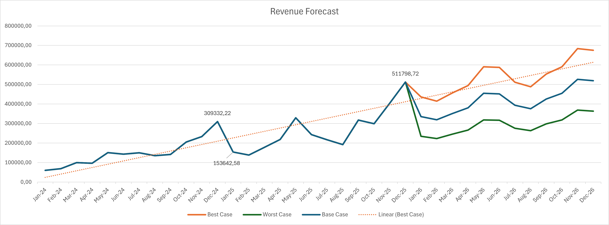

# Financial Forecasting Project

## Overview

This project is a continuation of my previous accounting flow project.

After building the accounting cycle from journal entries, general ledger, trial balance, and adjustment entries, I tried to continue the process into simple financial planning and forecasting.

The goal of this project is not to create a perfect corporate financial model, but to understand how historical accounting data can be transformed into forecasting, budgeting, and scenario analysis.

This project focuses on:

* Revenue forecasting
* Gross profit projection
* Scenario analysis
* Operating profit estimation
* Fixed vs variable expense behavior
* Simple budgeting approach using historical trends

## What I Did

Using historical monthly accounting data from 2024–2025, I created:

* Base Case Forecast
* Best Case Forecast
* Worst Case Forecast

  

The forecasting process combines:

* Historical trend forecasting using Excel
* Gross margin approach
* Revenue growth assumptions
* Expense behavior interpretation
* Simple scenario adjustments

## Forecasting Logic

### Revenue Forecast

Revenue was forecasted using historical monthly trends and Excel forecasting formulas.

Then several scenarios were created:

* Base Case → normal projected growth
* Best Case → higher revenue growth assumption
* Worst Case → slower growth assumption

### Cost of Goods Sold (COGS)

At first, I realized something important:

> Revenue and COGS cannot be separated.

If revenue increases, COGS should also increase.

Because of that, I stopped using:

* revenue up + COGS down

and replaced it with a more realistic approach using:

* Gross Profit Margin (GPM)

Historical margins were used as the base assumption to estimate future COGS behavior.

### Operating Expenses

This project also separates:

## Variable Components

* Revenue
* COGS
* Gross Profit

## Fixed Components

* Depreciation Expense
* Salaries & Wages
* Employer FICA Expense

Some expenses were treated as relatively stable because operationally they are less affected by short-term sales fluctuations.

## Dashboard Preview

The dashboard includes:

* Revenue trend
* Forecast scenarios
* Historical comparison
* Operating profit movement
* Trend line visualization

## Key Learning

One thing I learned from this project:

> Building the forecast itself is not the hardest part.

The difficult part is:

* making assumptions consistent,
* understanding relationships between accounts,
* and making the model still make sense operationally.

For example:

* Revenue affects COGS
* Margin assumptions affect profitability
* Fixed expenses behave differently from variable expenses

This project helped me understand that forecasting is not only about formulas, but also about business logic.

## Tools Used

* Microsoft Excel
* Pivot Table
* SUMIFS
* FORECAST.ETS
* Scenario Analysis
* Basic Financial Modeling

## Project Status

Completed as a learning and portfolio project.

Possible future improvements:

* Quarterly forecasting
* Cash flow forecasting
* Balance sheet projection
* More detailed budgeting model
* Power BI interactive dashboard

## Data Source

https://github.com/Zain-just-Zain/Accounting-Flow-Project

## Author

Zain_just_Zain